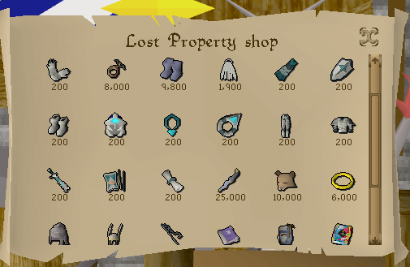
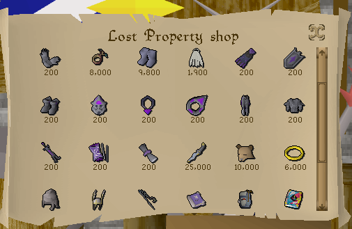

# Lost Property Diary Tiers

A RuneLite plugin for Old School RuneScape.

The Lost Property shop (run by Perdu and Chris), where you reclaim achievement diary
rewards, always shows the lowest (easy) tier of each reward, regardless of how much of
that diary you've actually completed.

This plugin updates the displayed reward to match your progress, showing the highest
diary tier you've completed. For example, if you've finished the Karamja Elite diary,
the shop shows *Karamja gloves 4* instead of the basic gloves.

| Before | After |
|:------:|:-----:|
|  |  |
